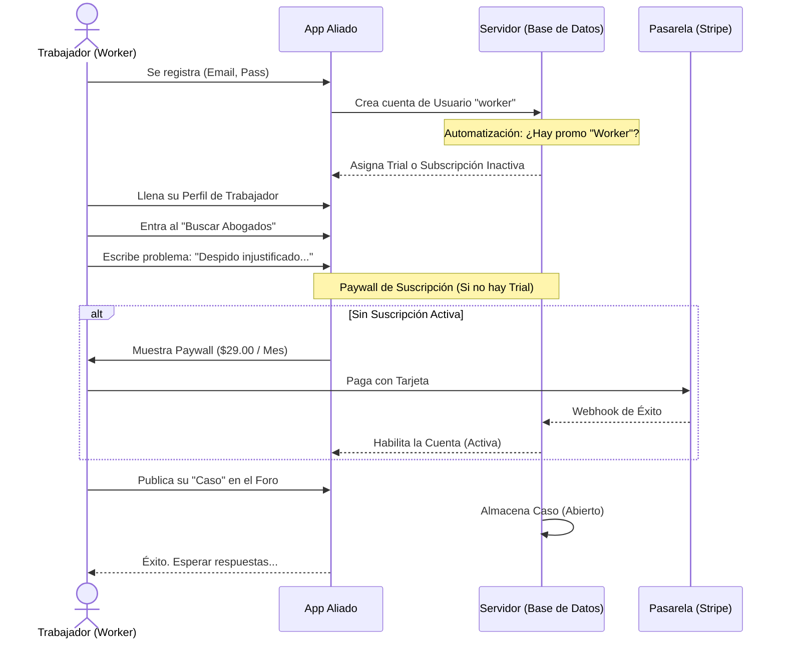
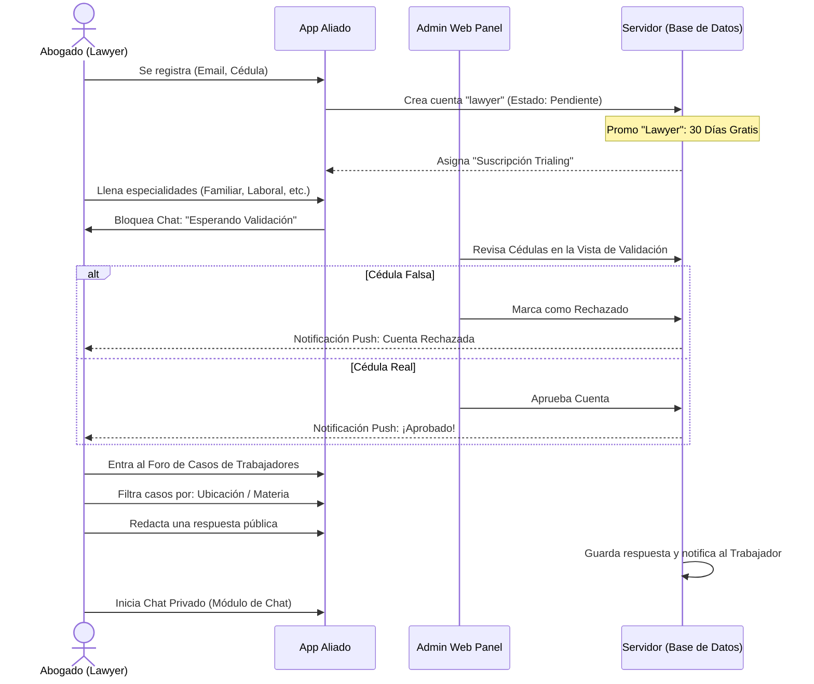
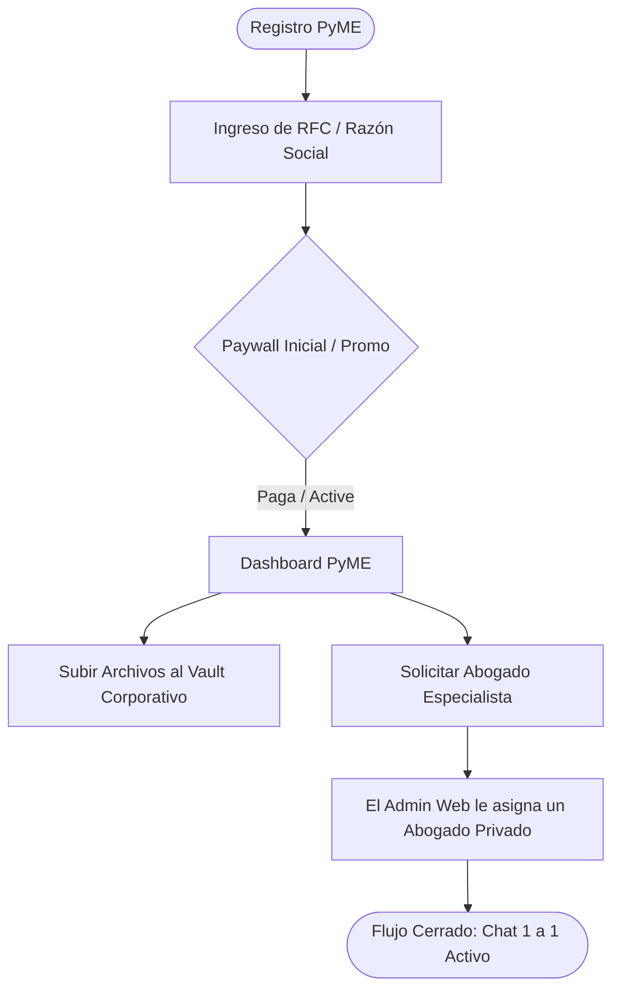

# Flujos de Trabajo Centrales - Aliado Laboral
> **Documento de Apoyo para Testers / QA**

Este documento visualiza los caminos (workflows) que deben recorrer los distintos roles de usuario dentro de la plataforma móvil para que puedan validar las reglas de negocio y los "Happy Paths".

---

## 👨‍🔧 1. Flujo del Trabajador (Worker Flow)

El objetivo principal de un trabajador es exponer su situación legal, encontrar abogados y eventualmente recibir asesoría mediante casos (tickets).

---

## 👩‍⚖️ 2. Flujo del Abogado (Lawyer Flow)

El abogado es el pilar de respuesta. Debe ser validado por el administrador antes de poder chatear y atraer clientes, y también paga una cuota de servicio.

## 🏢 3. Flujo PyME (Microempresa)
Las PyMEs interactúan para buscar asistencia masiva o auditorías legales. El proceso es más corporativo e incrusta un score de riesgo.

## ⚠️ Casos y Manejo de Errores a Probar (QA Edge Cases)
Al hacer el testing de la versión 1.20, por favor verificar explícitamente estas rutas críticas:
1. **Contraseña Invalida:** Intentar poner "1234", ver que exige letras. Poner espacios en blanco finales y ver que ya no marcan error en la confirmación.
2. **Foro Congelado:** Verificar que si la suscripción de un abogado "Expira" (`status: inactive`), el sistema *bloquea el foro* y lo redirecciona inmediatamente al Paywall de Stripe.
3. **Pausas y Strikes:** Un administrador web le pone un "Strike" a un abogado por lenguaje inapropiado. El abogado debería ver la penalización reflejada en su pantalla de inicio en tiempo real.
4. **Easter Egg (Mantenimiento):** Tocar 7 veces el logo de Aliado (Página de Login) debe disparar la navegación al componente oculto para desarrolladores.
